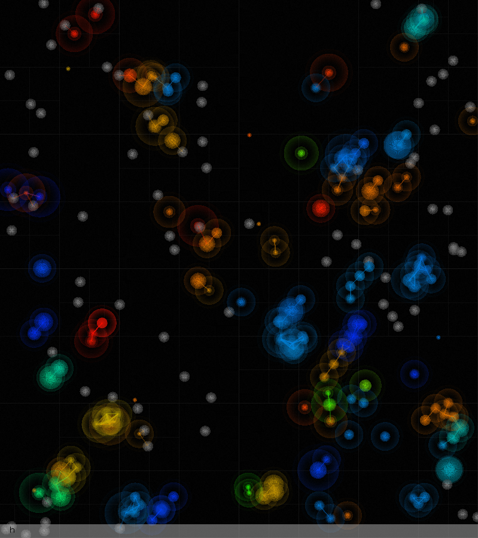

## Requirements
* GNU/Linux
* make
* gcc
* libglfw3
* libglew2.0
* libglfw3-dev
* libglew-dev
* ffplay (optional)
* python3 (optional)
* matplotlib (optional)
## How to use
 Install dependencies

`$ sudo apt-get install libglfw3 libglew2.0 libglfw3-dev libglew-dev ffmpeg`

 Grab the code:

`$ git clone https://github.com/connor-brooks/ecosim.git`

 Enter source directory:

`$ cd ecosim/src`

 Build:

`$ make`

 Run the simulation: 

`$ ./ecosim`
## Controls 
* Zoom: `ctrl` + `scroll wheel`
* Pan: `scroll wheel`
* Pause: `space`
* Quit: `q`
* Insert agent: `left click`
* Cycle agents: `left click` (hold)

## Behaviour of agents
Agents within the simulation constantly loose energy over time, as moving around in the environment causes energy to be burned. The only way energy levels can be increased is via consumption.

Dietary preferences of agents vary, but fall into two main categories: 
* Primary consumers - Agents which only take energy from non-living entities.
* Secondary consumers - Agents which only take energy from living agents, killing them in the process.

If an agents energy drops below a threshold, death occurs. In contrast, passing above a another threshold causes the agent to split into two copies of itself (asexual reproduction).

When an agent splits, it doesn't always make an exact copy of itself. Sometimes mutation occurs. This means that the genetic code (DNA) that dictates the agents behaviours is slightly modified.

These genetic traits are as follows:
* Metabolic rate
* Vision range
* Rebirth rate
* Dietary preference 
* Flocking strength
* Wobble frequency

Over time, only the most successful agents are able to pass on their DNA, causing the population of agents to slowly evolve.

However, it is important to note that there is no one-size-fits-all perfect agent. For a well functioning ecosystem to exist, balance is essential. For example: the existence of carnivores is essential to the existence of the herbivores in order to prevent overpopulation, which would result in mass-starvation and extinction of the herbivores.

## Traits in detail
### Metabolic rate
The metabolic rate is the rate which an agent transforms stored energy into kinetic energy. This has both pros and cons. Being able to move around the environment faster allows agents to consume food faster, but also causes the agent to eat more frequently.
### Vision range
This trait dictates how far an agent can sense other entities. A larger vision range is generally beneficial. However, this trait has some minor downfalls, especially for herbivorous agents. For example: hypersensitivity to other agents causes fleeing from non-dangerous situations, which in turn results in reduced ability to consume.
### Rebirth rate
Rebirth rate controls how much energy is stored within an agent before splitting (asexual reproduction) occurs. This is especially useful for agents with low metabolism, as it allows them to navigate the environment for a longer time without depleting their energy. 
### Dietary preference 
Agent's dietary preference influences what food source an agent will pursue and consume: living or non-living. For an ecosystem to be stable, the need for agents of both these groups is required.
### Flocking strength
Flocking is a behaviour in which agents form groups, or clusters, whilst navigating the map, forming "multicellular life". Paradoxically this offers both safety and vulnerability. By sharing information whilst flocking, a group increases it's members knowledge of other potential dangers or food. In contrast, if the group fails to avoid a potential danger the whole group suffers.
### Wobble frequency
Whilst moving around the screen, agents speed up and down in a sinusoidal pattern, creating a "crawling" effect. The frequency of this movement is dictated by the wobble trait. Wobbling has both advantages and disadvantages, with a lower frequency resulting in longer periods of increased speed but also longer resting periods.

## Tweaking the simulation 
Ecosim provides a way to configure the mechanics of the simulation via editing the `config.h` file. The process of doing so is as follows:

* Enter the `src` directory
* Edit the `config.h` file with the text editor of your choice
* Run `make clean`
* Run `make`

### What to change
This is entirely down to personal preference, however, most people will only be concerned with two sections of the configuration: The general agent settings, and the agent DNA settings.

### Enable logging
In order to use the population/trait logger, change the `LOGGER_ENABLE` setting to `1`, recompile, and run:

`./ecosim_with_log.sh`

Note, python3 and matplotlib is required in order to plot logged data.

### List of config settings
#### Main world settings
* `DEV_AGENT_COUNT` - The amount of agents to spawn when the simulation runs
* `DEV_GAME_FPS` - Frames per second (FPS) of the simulation
* `DEV_GAME_FOOD_SPAWN_FREQ` - How often (in seconds) to spawn food
* `DEV_GAME_FOOD_SPAWN_INIT` - How many items of food to spawn when the simulation runs
* `DEV_GAME_FOOD_SPAWN_MAX`/`DEV_GAME_FOOD_SPAWN_MIN` - The maximum and minimum amount of food that is spawned each food spawn
* `DEV_GAME_FOOD_ENERGY` - The amount of energy a piece of food provides when consumed
#### Agent general settings
* `AGENT_RGB_ALPHA` - Transparency of agent's inner cell
* `AGENT_VIS_ALPHA` - Transparaney of agent's vision field
* `AGENT_MAX_VELOCITY`/`AGENT_MIN_VELOCITY` - Agent velocity maximum / minimum
* `AGENT_ENERGY_DEFAULT` - Default energy of agents spawned at startup
* `AGENT_METAB_ENERGY_SCALE(x)` - The rate of which energy is burned over time, with respect to the metabolic rate of an agent (where x is metabolism)
* `AGENT_ENERGY_SIZE_SCALE(x)` - How large an agent is, with respect to their energy (where x is energy)
* `AGENT_MAX_SPEED` - The maximum speed any agent can move
* `AGENT_ENERGY_DEAD` - The energy level which an agent dies
* `AGENT_TIME_FACTOR` - How fast the process of ageing occurs
* `AGENT_DIET_BOUNDARY` - Herbivore / Carnivore boundary
#### Agent DNA settings
* `AGENT_DNA_MUTATE_RATE` - The maximum amount a trait can change if mutation occurs
* `AGENT_METAB_MAX`/`AGENT_METAB_MIN` - The maximum and minimum metabolic rates allowed
* `AGENT_VISION_MAX`/`AGENT_VISION_MIN` - The maximum and minimum vision field sizes allowed
* `AGENT_REBIRTH_MAX`/`AGENT_REBIRTH_MIN` - The maximum and minimum amount of energy stored in an agent before splitting occurs
* `AGENT_DIET_MAX`/`AGENT_DIET_MIN` - The maximum and minimum diet values allowed
* `AGENT_FLOCK_MAX`/`AGENT_FLOCK_MIN` - The maximum and minimum influence flocking has on agents
* `AGENT_WOBBLE_MAX`/`AGENT_WOBBLE_MIN` - The maximum and minimum amount an agent can wobble per second
#### Input settings
* `INPUT_SPAWN_DELAY` - How often to respawn agents when the mouse is held down
* `INPUT_SCROLL_AMT` - Input sensitivity (Effects scroll and zoom)
#### Log settings
* `LOGGER_ENABLE` - Enable / disable logging
* `LOGGER_FILE` - Filename to log to
* `LOGGER_FREQ` - Logging sample rate

## Notes 
* If you'd like some background noise to play whilst running the simulation, install ffmpeg, otherwise it's not required
* Please report any bugs or issues encountered whilst trying to run. Ideally please mention your distribution and graphics driver.
* Windows and Mac users: Don't worry, once Ecosim is ported to SDL2 it will be made officially multiplatform
